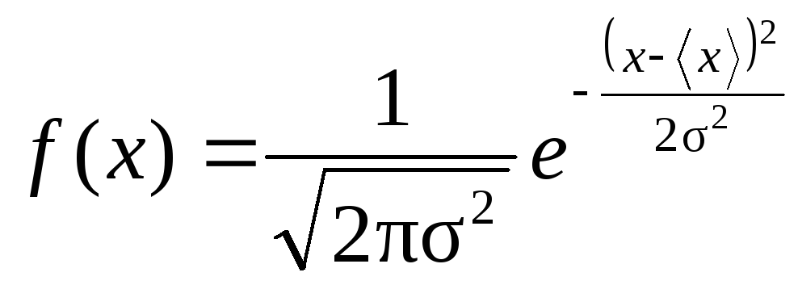
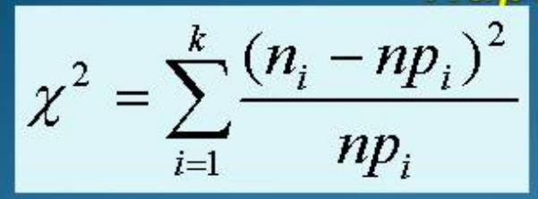

# Лабораторная 2
## Доверительный интервал
### Google Spreadsheets
- CONFIDENCE.NORM
    - A1 - альфа - уровень значимости
    - A2 - стандартное отклонение
    - A3 - выборка
- Формула: НОРМ.СТ.ОБР(1 - альфа / 2) * стандартное отклонение / sqrt(количество элементов выборки)
- НОРМ.СТ.ОБР - критическое значение стандартного нормального распределения (зависит от альфа)

### Scikit Learn
```
std = np.std(data, ddof=1)

alpha = 0.05 
z_crit = st.norm.ppf(1 - alpha/2) # Аналогично НОРМ.СТ.ОБР
margin = z_crit * (std / np.sqrt(n))

ci_lower = mean - margin
ci_upper = mean + margin
```

## Теоретическая вероятность
### Google Spreadsheets
- НОРМРАСП
    - A1 - x (правая граница отрезка)
    - A2 - Среднее значение
    - A3 - Стандартное отклонение
    - A4 - Истина - вероятность что значение будет <= x
- НОРМРАСП - НОРМРАСП - для последующих отрезков
- 1 - НОРМРАСП - для последнего





### Scikit Learn

```
cdf_values = st.norm.cdf(bin_edges, loc=mean, scale=std) # Передаем границы ячеек, среднее, стандартное отклонение
exp_probs = np.diff(cdf_values) # вычитаем, аналогично Excel

exp_probs[0] = st.norm.cdf(bin_edges[1], loc=mean, scale=std) # для первого и для последнего
exp_probs[-1] = 1.0 - st.norm.cdf(bin_edges[-2], loc=mean, scale=std)
```
